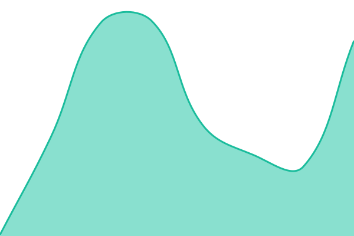
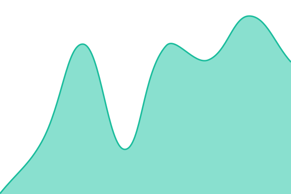
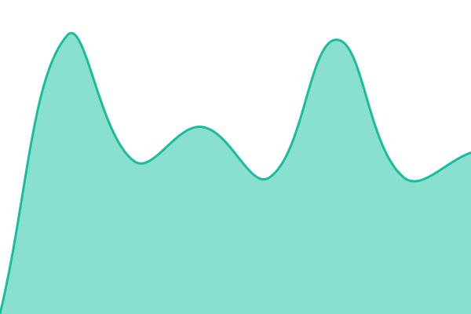
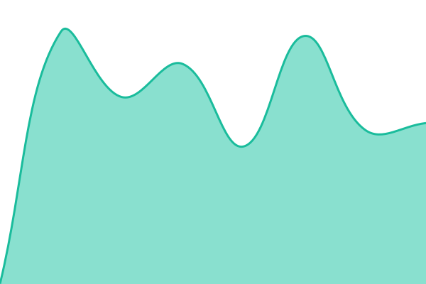

# [📈 Live Status](https://wk722.github.io/status): <!--live status--> **🟩 All systems operational**

This repository contains the open-source uptime monitor and status page for [wk722](https://wk722.github.io/status), powered by [Upptime](https://github.com/upptime/upptime).

With [Upptime](https://upptime.js.org), you can get your own unlimited and free uptime monitor and status page, powered entirely by a GitHub repository. We use [Issues](https://github.com/wk722/status/issues) as incident reports, [Actions](https://github.com/wk722/status/actions) as uptime monitors, and [Pages](https://wk722.github.io/status) for the status page.

<!--start: status pages-->
<!-- This summary is generated by Upptime (https://github.com/upptime/upptime) -->
<!-- Do not edit this manually, your changes will be overwritten -->
<!-- prettier-ignore -->
| URL | Status | History | Response Time | Uptime |
| --- | ------ | ------- | ------------- | ------ |
|  [Google](https://www.google.com/) | 🟩 Up | [google.yml](https://github.com/wk722/status/commits/HEAD/history/google.yml) | 

 76ms
     
 | 

<a href="https://wk722.github.io/status/history/google">100.00%</a>
    

|  [BazQux Reader](https://bazqux.com/) | 🟩 Up | [baz-qux-reader.yml](https://github.com/wk722/status/commits/HEAD/history/baz-qux-reader.yml) | 

 612ms
     
 | 

<a href="https://wk722.github.io/status/history/baz-qux-reader">100.00%</a>
    

|  [Hacker News](https://news.ycombinator.com/) | 🟩 Up | [hacker-news.yml](https://github.com/wk722/status/commits/HEAD/history/hacker-news.yml) | 

 280ms
     
 | 

<a href="https://wk722.github.io/status/history/hacker-news">100.00%</a>
    

|  [SourceHut Git](https://git.sr.ht/) | 🟩 Up | [source-hut-git.yml](https://github.com/wk722/status/commits/HEAD/history/source-hut-git.yml) | 

 791ms
     
 | 

<a href="https://wk722.github.io/status/history/source-hut-git">99.22%</a>
    

|  [linkhut](https://ln.ht/) | 🟩 Up | [linkhut.yml](https://github.com/wk722/status/commits/HEAD/history/linkhut.yml) | 

 935ms
     
 | 

<a href="https://wk722.github.io/status/history/linkhut">95.67%</a>
    

|  [Castlery SG](https://www.castlery.com/sg) | 🟩 Up | [castlery-sg.yml](https://github.com/wk722/status/commits/HEAD/history/castlery-sg.yml) | 

 2436ms
     
 | 

<a href="https://wk722.github.io/status/history/castlery-sg">98.68%</a>
    

|  [Castlery AU](https://www.castlery.com/au) | 🟩 Up | [castlery-au.yml](https://github.com/wk722/status/commits/HEAD/history/castlery-au.yml) | 

 2549ms
     
 | 

<a href="https://wk722.github.io/status/history/castlery-au">98.68%</a>
    

|  [Castlery US](https://www.castlery.com/us) | 🟩 Up | [castlery-us.yml](https://github.com/wk722/status/commits/HEAD/history/castlery-us.yml) | 

 662ms
     
 | 

<a href="https://wk722.github.io/status/history/castlery-us">98.69%</a>
    

|  [Castlery CA](https://www.castlery.com/ca) | 🟩 Up | [castlery-ca.yml](https://github.com/wk722/status/commits/HEAD/history/castlery-ca.yml) | 

 1004ms
     
 | 

<a href="https://wk722.github.io/status/history/castlery-ca">98.69%</a>
    

|  [Castlery UK](https://www.castlery.com/uk) | 🟩 Up | [castlery-uk.yml](https://github.com/wk722/status/commits/HEAD/history/castlery-uk.yml) | 

 1440ms
     
 | 

<a href="https://wk722.github.io/status/history/castlery-uk">98.69%</a>
    

<!--end: status pages-->

[**Visit our status website →**](https://wk722.github.io/status)

## 📄 License

- Powered by: [Upptime](https://github.com/upptime/upptime)
- Code: [MIT](./LICENSE) © [Anand Chowdhary](https://anandchowdhary.com), supported by [Pabio](https://pabio.com)
- Data in the `./history` directory: [Open Database License](https://opendatacommons.org/licenses/odbl/1-0/)
